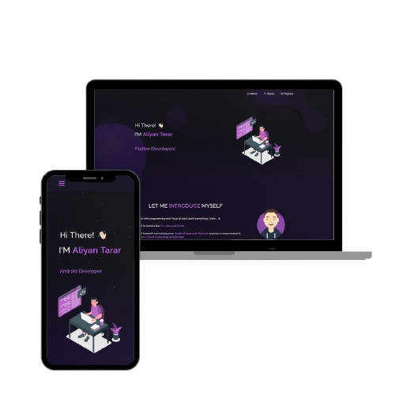

<h2 align="center">
  Portfolio Website - v2.0 
  <a href="https://aliyan-portfolio-chi.vercel.app/" target="_blank">MGM DEV</a>
</h2>

  

 

 &nbsp;
 &nbsp;
 &nbsp;
 &nbsp;

<h3 align="center">
    🔹
    <a href="https://github.com/github-mahar/Aliyan_Portfolio/issues">Report Bug</a> &nbsp; &nbsp;
    🔹
    <a href="https://github.com/github-mahar/Aliyan_Portfolio/issues">Request Feature</a>
</h3>

---

## TL;DR

You can fork this repo to modify and make changes of your own.  
If you like it, please give me proper credit by linking back to [github-mahar](https://aliyan-portfolio-chi.vercel.app/).  
Thanks!

---

## 🛠 Built With

My personal portfolio — [MGM DEV](https://aliyan-portfolio-chi.vercel.app/) — showcases my skills, projects, and achievements. 

This project was built using the following technologies:

- React.js
- Javascript
- HTML
- CSS3
- VsCode
- Git
- Github
- Bootstrap
- TailwindCSS

## Features

**📖 Multi-Page Layout**

**🎨 Styled with React-Bootstrap and Css with easy to customize colors**

**📱 Fully Responsive**

## Getting Started

Clone down this repository. You will need `node.js` and `git` installed globally on your machine.

## 🛠 Installation and Setup Instructions

1. Installation: `npm install`

2. In the project directory, you can run: `npm start`

Runs the app in the development mode.\
Open [http://localhost:3000](http://localhost:3000) to view it in the browser.
The page will reload if you make edits.

## Usage Instructions

Open the project folder and Navigate to `/src/components/`.  
You will find all the components used and you can edit your information accordingly.  
You can add, remove or rearrange them as per your wish. 
